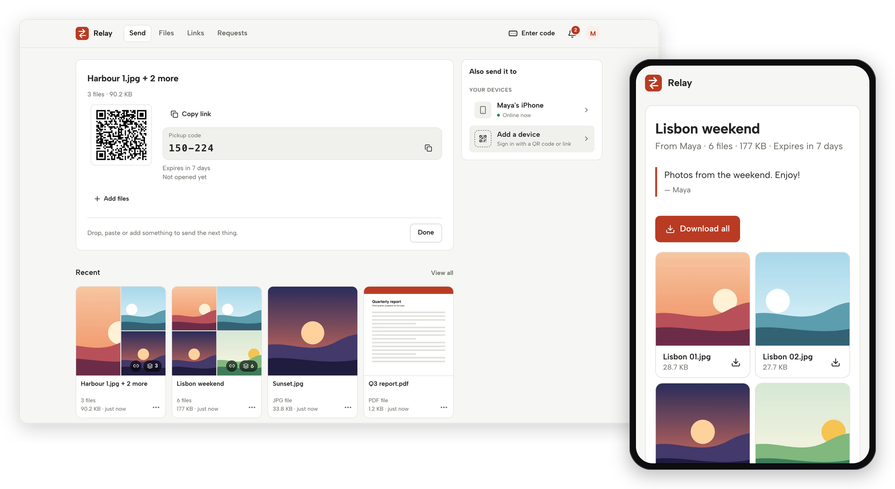
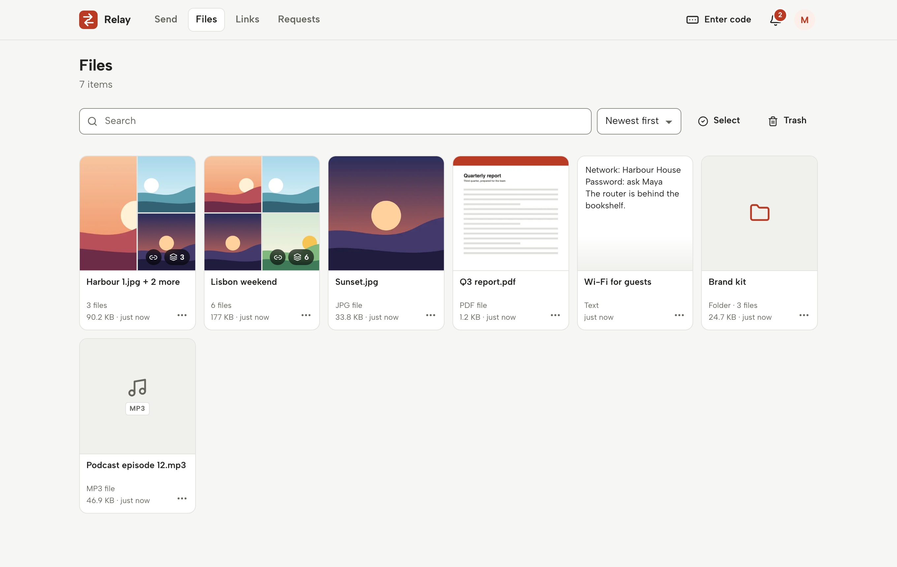
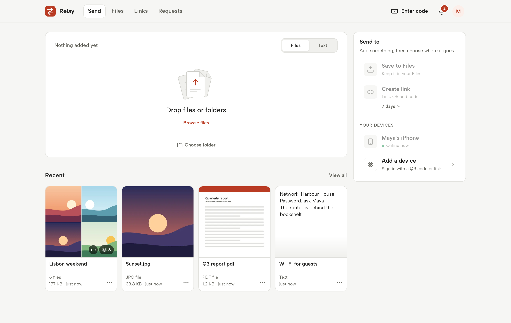

<div align="center">


# Relay

**Private file, folder and text transfers for your people, on your own server.**

Drop anything in and choose where it goes: your library, a link, or another of your devices.<br>
Resumable uploads of any size, streamed downloads, and nothing stored anywhere you don't control.

[](https://github.com/walriyami/Relay/actions/workflows/ci.yml)


[Features](#features) · [Quick start](#quick-start) · [Self-hosting](docs/self-hosting.md) · [Architecture](docs/architecture.md) · [Development](docs/development.md)

<br>

<picture>
  <source media="(prefers-color-scheme: dark)" srcset="docs/images/hero-dark.png">
  
</picture>

</div>

## Features

<table>
<tr>
<td width="50%" valign="top">

### 📤 Send anything, decide later

Drop or paste files, whole folders and text into one draft. Nothing uploads until you pick a destination: **Save to Files**, **Create link**, or **send to one of your online devices**.

</td>
<td width="50%" valign="top">

### ⏯️ Large files that survive

Uploads use the resumable [tus](https://tus.io) protocol in 8 MiB chunks, several at a time. A dropped network or a server restart picks up where it left off. You can pause or cancel any transfer.

</td>
</tr>
<tr>
<td valign="top">

### 🔗 Links with a QR code and a pickup code

Every share gets a link, a QR code and a short numeric code. Links can expire, need a password, admit only one person, carry a note, and show you how many people opened and downloaded them.

</td>
<td valign="top">

### 🗂️ A library that keeps everything

Every completed upload is saved first, whether you shared it or not. Search, sort and preview images, video, audio, PDFs and text. Download any folder as a ZIP. Deleted items wait in Trash for the chosen recovery period (30 days by default), bounded by the administrator's maximum content age.

</td>
</tr>
<tr>
<td valign="top">

### 📥 Upload requests

Ask someone without an account to send you files. They open a link, drop files in, and the files land in your library, counted as your storage.

</td>
<td valign="top">

### 🔐 Private by design

Accounts are invite-only. Sign in with a password, a passkey, or a code from a device where you're already signed in. Administrators manage accounts and limits. Their dashboard does not browse members’ files, but administrators are trusted: resetting a member’s password lets them sign in as that member.

</td>
</tr>
<tr>
<td valign="top">

### 📱 Built for every screen

Responsive from phones to desktops, with light, dark and system themes. Keyboard-accessible, and tested in Chromium, Firefox, WebKit and a mobile viewport.

</td>
<td valign="top">

### 🧱 Simple to run

One container, one SQLite database, one data volume. Each unique file is stored once. It needs no external services.

</td>
</tr>
</table>

## Screenshots

<table>
<tr>
<td width="50%"><picture><source media="(prefers-color-scheme: dark)" srcset="docs/images/files-dark.png"></picture></td>
<td width="50%"><picture><source media="(prefers-color-scheme: dark)" srcset="docs/images/send-dark.png"></picture></td>
</tr>
<tr>
<td align="center"><sub><b>Files</b>: every upload, with previews, search and Trash</sub></td>
<td align="center"><sub><b>Send</b>: drop anything in, then choose where it goes</sub></td>
</tr>
</table>

## Quick start

You need [Docker](https://docs.docker.com/get-docker/) with Docker Compose.

```sh
git clone https://github.com/walriyami/Relay.git relay
cd relay
docker compose up -d --build
```

The default stack creates its own network and binds to loopback. For a containerized HTTPS proxy or tunnel, see the [optional network overlay](docs/self-hosting.md#proxy-in-another-container).

Open **http://localhost:3090** to create your administrator account, choose member limits, and invite people. If others can reach the server before you finish setup, set `RELAY_SETUP_KEY=true` so setup also asks for a one-time key only the server's owner can read. For a public hostname, first set `RELAY_ORIGIN` to your HTTPS address; see [self-hosting](docs/self-hosting.md).

> [!TIP]
> To share Relay beyond your own machine, put it behind HTTPS. The [self-hosting guide](docs/self-hosting.md) covers reverse proxies, optional settings and updates.

## Documentation

| Guide                                | What it covers                                                           |
| ------------------------------------ | ------------------------------------------------------------------------ |
| [Self-hosting](docs/self-hosting.md) | Docker Compose, HTTPS reverse proxies, configuration, limits and updates |
| [Architecture](docs/architecture.md) | How transfers, storage, downloads and security fit together              |
| [Development](docs/development.md)   | Local setup, tests, release checks and conventions                       |
| [Security policy](SECURITY.md)       | Reporting vulnerabilities and the security model                         |
| [Changelog](CHANGELOG.md)            | What changed in each release                                             |

## Built with

[React 19](https://react.dev) · [TypeScript](https://www.typescriptlang.org) · [Vite](https://vite.dev) · [Fastify](https://fastify.dev) · Node.js 24 with built-in [SQLite](https://nodejs.org/api/sqlite.html) · [tus](https://tus.io) · [zod](https://zod.dev) · [sharp](https://sharp.pixelplumbing.com) · [pdf.js](https://mozilla.github.io/pdf.js/) · [Playwright](https://playwright.dev)

## License

Copyright © 2026 walriyami. All rights reserved.

This repository has no open-source license. You may view the code on GitHub, but no permission is granted to copy, modify or distribute it. Please ask if you'd like to use it. Relay's interface font, [Albert Sans](https://github.com/usted/Albert-Sans), has its own license, the SIL Open Font License (see [`public/assets/AlbertSans-OFL.txt`](public/assets/AlbertSans-OFL.txt)).
