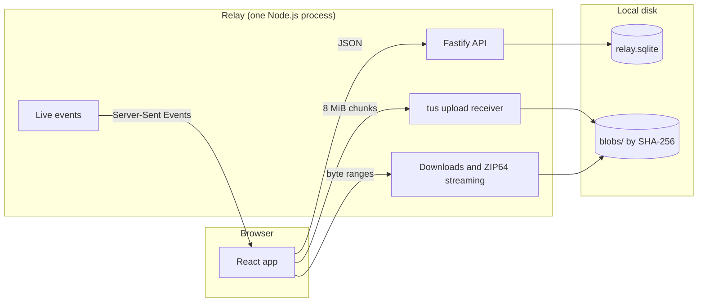

# Architecture

Relay is a single Node.js process that serves a React web app and a JSON API, and keeps everything on one local disk.



## Principles

- **Saving comes first.** Every completed upload is saved to the owner's library before anything else happens. A link or a delivery to a device only points at saved content, so it never moves or deletes the original.
- **Honest states.** A file counts as saved only after it's flushed to disk and recorded in the database. An interrupted upload never looks saved, and Relay never claims a download reached someone's disk.
- **One process, one disk.** Relay makes no attempt at clustering. SQLite holds an exclusive lock on the data directory, so a second process fails immediately instead of corrupting data.
- **Bounded transfer buffers.** Uploads, downloads and archives stream instead of buffering whole files. Preview decoding has separate pixel, concurrency and lifecycle limits; source complexity can still affect decoder memory.

## Transfers

1. The browser announces a transfer as one manifest: its files, folders and optional text. The server creates the pending item and one upload per file in a single transaction.
2. Each file uploads separately over the [tus](https://tus.io) resumable protocol in 8 MiB chunks, several at a time. The server hashes bytes as they arrive, so finishing even a very large file is instant.
3. When every file is in, the browser completes the transfer with a destination: **Save**, **Create link**, or **Send to a device**.

Uploads belong to the browser tab that started them. The tab holds a lease through its event stream or a short authenticated capacity probe. If the network drops or the server restarts, the tab resumes from the server's confirmed offset. When a tab closes or reloads, its unfinished uploads are abandoned on purpose. If a tab disappears without warning, its uploads are released five minutes after it was last heard from.

Persistent event streams are capped at four per member session, two per guest grant, and four across a cooperating browser origin. Overflow tabs use short probes without evicting existing streams, keeping HTTP/1 connections available for API calls and uploads. A shared random browser ID coordinates admission but grants no access. When browser storage is unavailable, tabs use probes. Credentials are checked at most every 20 seconds; durable leases and device timestamps are batched at most once a minute (sooner for short leases). Failed connections retry with jitter and bounded backoff.

Successful authenticated member probes also keep the device available for direct delivery. This presence expires 50 seconds after the last successful probe under the default timing, allowing one missed poll; guest probes do not create member presence. Presence and delivery checks revalidate credentials, so expired, signed-out, or suspended sessions cannot remain reachable.

Every API response carries a change stamp: how many changes the server had published when it began reading. A stream reports the same count when it opens, and it delivers every change after that. A view whose last answer is at least that recent has missed nothing, so opening the app or reconnecting reloads only the views that may have fallen behind.

## Direct transfers

On the server's own network, a member's uploads and downloads skip the internet connection. Relay runs a helper as a child process, so a failure in its native WebRTC library can't take Relay down, and starts it again if it stops. The helper accepts WebRTC connections on one UDP port. The browser asks Relay to set a connection up: Relay passes its offer to the helper with a token for the member's session, and returns the helper's answer. The offer names the browser's addresses, usually as `.local` names, and the answer the host's private addresses. The helper checks the browser's candidates from its port and the browser checks the helper's, so the connection comes up even where the host's address can't be known or reached first, as from a container on Docker Desktop. Only local network addresses are ever checked, so the connection works only on the server's networks, and no STUN or TURN server is involved. The browser counts the connection as ready only once a check request has made the whole trip back to Relay.

Each request then travels on a data channel of its own: a head, the body in 64 KiB messages under a 4 MiB credit window each way, the response, and an end. The helper passes it to Relay over a Unix socket in a private directory the two share, carrying the session token instead of cookies. That socket serves only the bulk routes (upload chunks, file and ZIP downloads, and the check) as the session behind the token, and refuses anything else. The protocol is in `shared/local.ts`.

- **Uploads** keep tus: only the transport changes, request by request. A chunk that fails on the direct connection is retried the usual way from the server's offset. Chunk sizes adapt to each route's measured throughput.
- **Downloads** arrive on a data channel and are handed to a service worker (`public/local-sw.js`), which serves them to a hidden frame as an ordinary download. The browser saves them to disk as they arrive, with its own progress and cancel. Back pressure runs from the disk through the worker and the page to the helper. If the connection drops, the rest comes over HTTP from the same byte, with `If-Range` ensuring it's the same file. After an upgrade, a newer worker waits until no download depends on the old one, because taking over would cut off the downloads the old one is serving.
- **Guests** never go direct. The helper acts for the session that set up the connection, so a link or request grant would not travel.

## Storage

- **Content-addressed files.** Each unique file is stored once under `blobs/`, named by its SHA-256. Several items can share the same bytes, and each owner's storage still counts their saved size.
- **Library.** Items hold a tree of folders, files and text. Items are never edited in place. They can be renamed and have files added, and nothing inside is replaced or removed.
- **Retention and Trash.** The first meaningful saved content anchors an item's age. The member's Files duration sets its initial expiry; the strictest admin maximum age also bounds renewal and Trash. Pending-only upload scaffolding has no age until first save. Trash stores a fixed purge deadline, which may shorten but never extend. Automatic Trash begins at the original expiry, not the maintenance run. Access checks deny expired content even before cleanup. Restoring recoverable content does not restore its old links. Unreferenced blob rows remain durable cleanup work until payload and renditions are durably removed.
- **Schema.** `server/db/schema.sql` creates and versions an empty database atomically. Startup rejects a mismatched version or schema without modifying the data. Preserve existing data and start with a new directory after incompatible prerelease schema changes.

Administrators can run resumable integrity scans that hash stored files sequentially. Missing, corrupt and unreadable files remain recorded as degraded; healthy content stays available. A verified new upload can atomically repair damaged content with the same hash and invalidate stale previews.

## Downloads

- Every file download supports HTTP byte ranges.
- Folders and whole items download as uncompressed ZIP64 archives, streamed on demand. Relay computes each archive's layout from the stored sizes and checksums, so archives support exact byte ranges too, with nothing prepared or cached.
- Server thumbnails cover images, including HEIC. PDFs are rendered in the browser with pdf.js from byte ranges, so they preview on phones that can't show PDFs inline.

## Accounts and access

- Accounts are created by invitation only. The first account is created in the browser during setup: whoever finishes that step first becomes the administrator, and setup then closes for good.
- People sign in with a password (hashed with scrypt), a passkey (WebAuthn), or a one-time code shown on another of their signed-in devices.
- Sessions use `HttpOnly`, `SameSite` cookies (`__Host-` prefixed over HTTPS). Every unsafe request must come from the address it was sent to (exactly `RELAY_ORIGIN`, when set) and carry a CSRF token.
- Link, request and invitation tokens are derived from their ids with an HMAC key (`RELAY_SECRET`). The database stores only hashes of those tokens.
- Short numeric codes (four or six digits) are rate-limited per address and across the service. A retired code is never reassigned.
- Every content and archive route checks authorization. Administrators manage accounts and limits and see how much each member stores and moves, but they can't read members' files or links.

Relay isn't end-to-end encrypted. Whoever operates the server can read what's stored on it.

## Project layout

```text
client/            React app
  app/             Shell, routing, session, public pages
  components/      Shared UI components
  features/        One folder per area: send, library, links, requests, incoming, settings, admin…
  lib/             Transfers engine, live connection, formatting, previews
  styles/          Design tokens and CSS
local/             Direct-transfer helper, run by Relay (WebRTC to Relay's local socket)
server/
  app.ts           Fastify setup, security headers, rate limits, route wiring
  config.ts        Environment configuration
  db/              SQLite connection and schema
  modules/         One folder per domain: auth, transfers, library, links, downloads, admin…
  storage/         Content-addressed blob store and file helpers
shared/            Typed API contract (zod) and models used by both sides
scripts/           Screenshots and release verification
tests/             Backend integration tests (node:test)
tests/browser/     End-to-end journeys (Playwright)
```

The API contract lives in `shared/api.ts`. Each endpoint declares its method, path, auth level and zod schema once. The server validates requests against it, and the client and tests call endpoints through it with full types.
