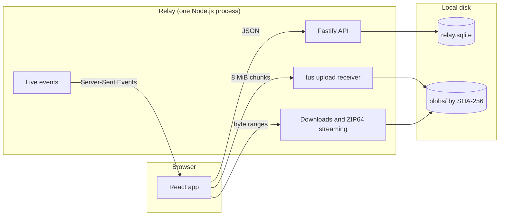

# Architecture

Relay is a single Node.js process that serves a React web app and a JSON API, and keeps everything on one local disk.



## Principles

- **Saving comes first.** Every completed upload is saved to the owner's library before anything else happens. A link or a delivery to a device only points at saved content, so it never moves or deletes the original.
- **Honest states.** A file counts as saved only after it's flushed to disk and recorded in the database. An interrupted upload never looks saved, and Relay never claims a download reached someone's disk.
- **One process, one disk.** Relay makes no attempt at clustering. SQLite holds an exclusive lock on the data directory, so a second process fails immediately instead of corrupting data.
- **No browser-sized buffers.** Uploads, downloads, archives and previews all stream, so a 100 GiB file needs no more memory than a small one.

## Transfers

1. The browser announces a transfer as one manifest: its files, folders and optional text. The server creates the pending item and one upload per file in a single transaction.
2. Each file uploads separately over the [tus](https://tus.io) resumable protocol in 8 MiB chunks, several at a time. The server hashes bytes as they arrive, so finishing even a very large file is instant.
3. When every file is in, the browser completes the transfer with a destination: **Save**, **Create link**, or **Send to a device**.

Uploads belong to the browser tab that started them. The tab holds a lease through its event stream. If the network drops or the server restarts, the tab resumes from the server's confirmed offset. When a tab closes or reloads, its unfinished uploads are abandoned on purpose. If a tab disappears without warning, its uploads are released five minutes after it was last heard from.

## Storage

- **Content-addressed files.** Each unique file is stored once under `blobs/`, named by its SHA-256. Several items can share the same bytes, and quotas still count each owner's saved size.
- **Library.** Items hold a tree of folders, files and text. Items are never edited in place. They can be renamed and have files added, and nothing inside is replaced or removed.
- **Trash.** Deleted and expired items stay in Trash for 30 days. Their links stop working immediately, and restoring an item doesn't bring its links back.
- **Schema.** `server/db/schema.sql` creates a new database on first start. The database records its schema version, and Relay refuses to open one from a different version.

## Downloads

- Every file download supports HTTP byte ranges.
- Folders and whole items download as uncompressed ZIP64 archives, streamed on demand. Relay computes each archive's layout from the stored sizes and checksums, so archives support exact byte ranges too, with nothing prepared or cached.
- Server thumbnails cover images, including HEIC. PDFs are rendered in the browser with pdf.js from byte ranges, so they preview on phones that can't show PDFs inline.

## Accounts and access

- Accounts are created by invitation only. The first account, `admin`, is bootstrapped from `RELAY_ADMIN_PASSWORD`.
- People sign in with a password (hashed with scrypt), a passkey (WebAuthn), or a one-time code shown on another of their signed-in devices.
- Sessions use `HttpOnly`, `SameSite` cookies (`__Host-` prefixed over HTTPS). Every unsafe request is checked against `RELAY_ORIGIN` and a CSRF token.
- Link, request and invitation tokens are derived from their ids with an HMAC key (`RELAY_SECRET`). The database stores only hashes of those tokens.
- Short numeric codes (four or six digits) are rate-limited per address and across the service. A retired code is never reassigned.
- Every content and archive route checks authorization. Administrators manage accounts and limits, but they can't read members' files, links or activity.

Relay isn't end-to-end encrypted. Whoever operates the server can read what's stored on it.

## Project layout

```text
client/            React app
  app/             Shell, routing, session, public pages
  components/      Shared UI components
  features/        One folder per area: send, library, links, requests, incoming, settings, admin…
  lib/             Transfers engine, live connection, formatting, previews
  styles/          Design tokens and CSS
server/
  app.ts           Fastify setup, security headers, rate limits, route wiring
  config.ts        Environment configuration
  db/              SQLite connection and schema
  modules/         One folder per domain: auth, transfers, library, links, downloads, admin…
  storage/         Content-addressed blob store and file helpers
shared/            Typed API contract (zod) and models used by both sides
scripts/           Screenshots and release verification
tests/             Backend integration tests (node:test)
tests/browser/     End-to-end journeys (Playwright)
```

The API contract lives in `shared/api.ts`. Each endpoint declares its method, path, auth level and zod schema once. The server validates requests against it, and the client and tests call endpoints through it with full types.
